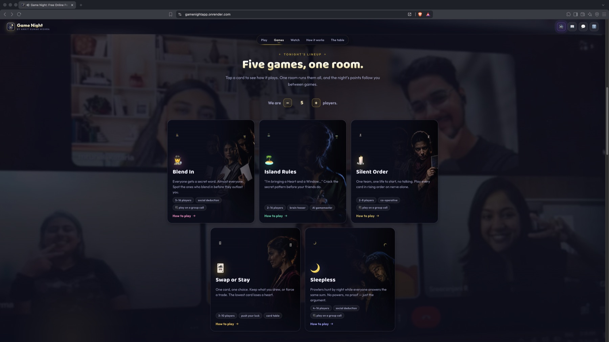
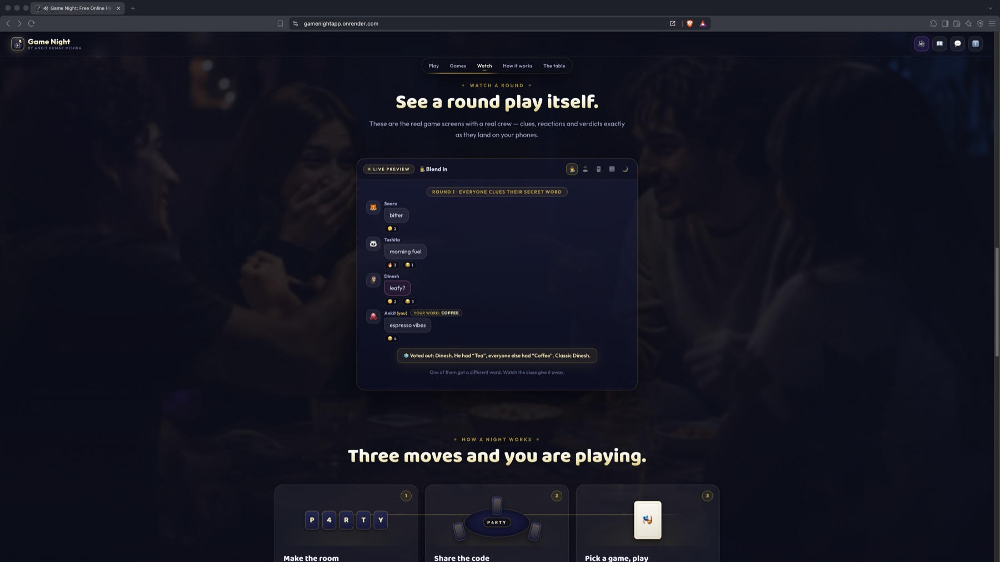
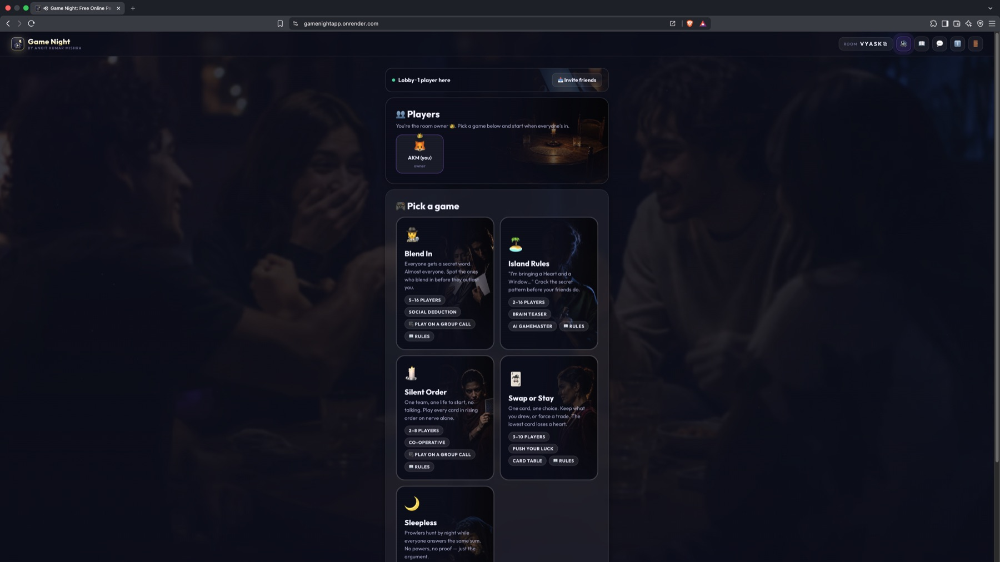

# 🎭 Game Night

*by Ankit Kumar Mishra*

**Your crew, your rules. One room code away.**

Real-time party games in a browser tab. Someone creates a room, everyone else types the
five-letter code, and you play on your own phones. No download, no account, no timers.

**Designed and built by Ankit Kumar Mishra**
[LinkedIn](https://www.linkedin.com/in/ankitkumarmishra/) · [GitHub](https://github.com/AnkitKumarMishra5)

---

## A look at it

<p align="center">
  
</p>

<p align="center">
  
</p>

<p align="center">
  
</p>

<p align="center">
  
</p>

---

## The games

### 🕵️ Blend In (5 to 16 players)

Everyone gets a secret word. Almost everyone: a few get a slightly different one, and one
may get nothing at all. Take turns giving a one-word clue, argue about who sounded off,
vote somebody out. Say too much and you hand it to the outsiders; say too little and you
look like one.

The AI deals a fresh word pair every game at easy, medium, hard or ultra difficulty, from
Coffee and Tea down to Ocean and Sea. Roles scale with the table, and the room owner starts
the vote when the talking is done, so nothing is on a clock.

### 🏝️ Island Rules (2 to 16 players)

*"I'm going to an island and I'm bringing a Heart and a Window."* There is a rule behind
what the boat accepts. Ask whether your item can come aboard, watch which ones get in, and
work out the rule before anyone else. State it in your own words and an AI judge decides
whether you have it, however you phrase it. Three wrong guesses and you sit the round out.

Stuck? The table earns one hint per round, spent by the room owner once everyone agrees.
An audit button lets the table make the AI judge re-read every ruling if something smells
off, and the room owner can hand the gamemaster chair to any player.

### 🕯️ Silent Order (2 to 8 players)

One co-operative deck, one shared life (clear a level, earn another), no talking. Each level deals everyone cards from 1 to
100 and the table must play them in ascending order on nothing but nerve. Play too early
and everything lower burns. A shared 3D card table deals every round with a riffle shuffle.

### 🃏 Swap or Stay (3 to 10 players)

One card each, face down. Keep it, or force a swap with your neighbour — unless they are
holding a Sentinel, which blocks you and outranks everything. Lowest card at the reveal
loses a heart; last player standing wins.

### 🌙 Sleepless (4 to 16 players)

Prowlers hunt at night (a pack of up to three on big tables) and a Medic guards a door,
never the same one two nights running. Everyone else just sleeps — no night powers. The
night is a counting puzzle: every player answers the same kind of sum and taps ready, so
every screen is equally busy and nothing betrays a role. Days are sealed votes with no
private information to lean on, ties walk free, and the village wins when the last Prowler
falls.

## Run it

```bash
npm install
npm start          # http://localhost:3456
```

That is the whole setup. Island Rules' AI gamemaster needs a key; without one the room
owner runs the round themselves and can draw from a bank of 60 built-in patterns.

```bash
cp .env.example .env      # then add OPENAI_API_KEY=sk-...
```

Play against bots while you build:

```bash
npm run bots -- ABCDE 4   # four bots join room ABCDE and play on their own
```


## What it is built on

Node 18+, Express and Socket.IO on the server. Vanilla ES modules on the client, no
framework and no build step, so what you edit is what runs. The server is authoritative:
every client receives a snapshot personalised to them, so your word is in your payload and
nobody else's is. Rooms live in memory and vanish when the last player leaves.

```
server/
  index.js              socket protocol and HTTP routes, wiring only
  lib/openai.js         generic LLM client, knows nothing about any game
  lib/util.js           ids, room codes, fuzzy word matching
  lib/quips.js          the app's sense of humour
  core/rooms.js         room registry, host transfer, snapshots
  core/scores.js        points, titles, per-room leaderboard
  core/analytics.js     usage log and the metrics derived from it
  core/dashboard.js     the owner's dashboard, one self-contained page
  games/blendin/        engine.js, wordPairs.js
  games/island/         engine.js, patterns.js, ai.js  (the only AI in the app)
  games/silentorder/    engine.js
  games/swaporstay/     engine.js
  games/sleepless/      engine.js
public/
  index.html            shell, SEO tags, structured data
  css/style.css         one stylesheet
  js/main.js            socket client, landing page, lobby, PWA install
  js/core/              DOM toolkit, confetti, sound effects, music, backdrop, rules modal
  js/games/registry.js  the game list; register a new game here
  js/games/<game>/      that game's screens and rules copy
  js/core/cards.js      the shared 3D card table: shuffle, deal, peek, throw
  sw.js                 service worker, network-first for code
tests/e2e.mjs           570+ checks against a real server with real socket clients
tests/games/            one self-contained suite per card game
tools/                  brand assets, backdrop pipeline, bots, link-preview checker
source-assets/          full-resolution originals, deliberately outside public/
```


### Adding a game

1. `server/games/<name>/engine.js` exporting `snapshot(room, playerId)`, your action
  handlers, `removePlayerFromGame` and `onConnectivityChange`.
2. `public/js/games/<name>/index.js` and `rules.js` for the screens and the how-to-play.
3. Register it in `public/js/games/registry.js` and wire its events in `server/index.js`.

Nothing else in the app needs to know it exists.

## Tests

```bash
npm test              # 220 checks, spawns a real server, no API key needed
npm run test:ai       # 55 checks against the live OpenAI API, needs a key
```

The suite drives real `socket.io-client` connections through full games: wins and losses on  
both sides, ties and runoffs, players leaving mid-vote and mid-guess, host transfer,  
rejoining, malformed payloads, scoring, the guess limit, hints, and the dashboard. It  
writes to a temporary directory, so running it never touches your real usage log.

## Privacy and legal

A Privacy and Terms panel lives in the footer and in **ℹ️ About**. Standard analytics are
collected (device, browser, visit, activity) and used only to run and improve the app.
IP addresses are never stored, only hashed. Nothing typed inside a game is recorded. There
are no cookies, no ad networks and no third-party trackers. In Island Rules' AI mode the
items you type go to OpenAI to be judged, with no name, room or identifier attached.

Every socket is capped at 120 events per 10 seconds. Intended for players 13 and over.

## Author

**Ankit Kumar Mishra**  
[LinkedIn](https://www.linkedin.com/in/ankitkumarmishra/) ·
[GitHub](https://github.com/AnkitKumarMishra5)

## License

**Proprietary. © 2026 Ankit Kumar Mishra. All rights reserved.** See [LICENSE](LICENSE).

You may read this code and run it locally to evaluate it. You may not copy, host, deploy,
adapt or commercialise it, or use the Game Night name, logo or the author's likeness,
without written permission. Publishing the source here is not a licence to reuse it, but
ask and permission is often given for non-commercial and educational use.